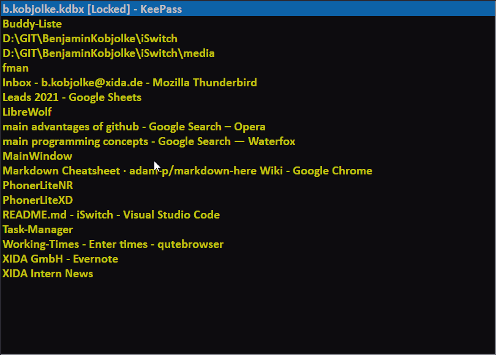

# iSwitch

Switch fast between open windows (Windows tool)

## Installation

Download the latest release and start the .exe

## Usage

Use caps-lock to show the window.

When the window is open, just type a few letters matching the desired window's title.

## Config

If you want to ignore some windows
reanme filterlist_example.txt to filterlist.txt and add the windows' titles that you dont want like this "firefox|chrome|winamp"

I found the original script here:

> https://www.autohotkey.com/board/topic/30487-iswitchw-cosmetically-enhanced-edition/

_It's a window switcher which shows the matching window titles as you type in your search string incrementally. If only one window is left it is activated immediately (configurable). Otherwise, you can type in more characters (or delete some with backspace) or select between the matching windows using cursor up/down/enter or you can cancel the window with esc._

_You can use any substring of any window. For example, if you want to switch to word then you can type rd and there is a good chance word is selected immediately. Or type "notepad" and select quickly between the notepad windows with the cursor._

_The idea comes from Emacs where it is used to switch between opened files. After a while it gets addictive, it's so efficient. At least it is my experience with emacs._

## New features addded:

### Move mouse

Mouse will be moved to the center of the selected window

## Filter list

Array of filters for filtering out titles from the window list.

Rename filterlist_example.txt to filterlist.txt and add the windows you do not want to show up to that list.
Seperate titles with a "|".

## Shortcuts list

List of shortcuts for window titles.
So if you type "wa" it will search for winamp.

Rename shortcuts_example.txt to shortcutslist.txt and add the windows you do not want to show up to that list.
One shortcut per line
; example: wa|winamp
